<p align="center">
  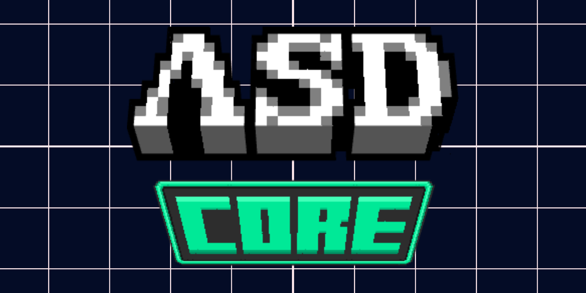
</p>

<h1 align="center">ASDCore</h1>

<p align="center">
  Personal Minecraft Core Plugin • Paper 1.21.4 • NothionMC Internal Project
</p>

<p align="center">
  
</p>

<p align="center">
  
  
  
  
</p>

---

<p align="center">
  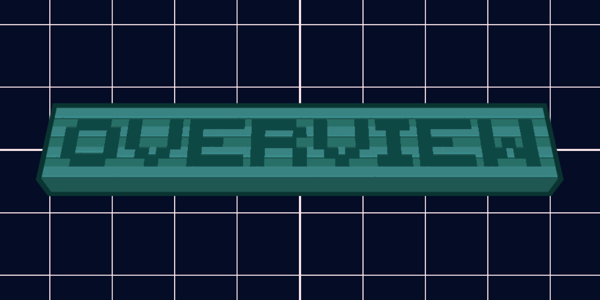
</p>

<p align="center">
  
</p>

ASDCore is a private large-scale Minecraft core plugin developed for my own server ecosystem.

It is not designed as a simple utility plugin. ASDCore works as a central gameplay infrastructure layer, connecting multiple systems into one unified experience: custom items, custom blocks, region mechanics, ranked activities, fishing progression, donation events, pets, leaderboards, XP banking, changelogs, server utilities and experimental gameplay modules.

The main goal of ASDCore is to make Minecraft feel deeper, more dynamic and more custom without depending on dozens of separated systems that do not communicate with each other.

> Available only for Paper `1.21.4`.  
> This is a personal project created for my own server, not a public commercial resource.

---

<p align="center">
  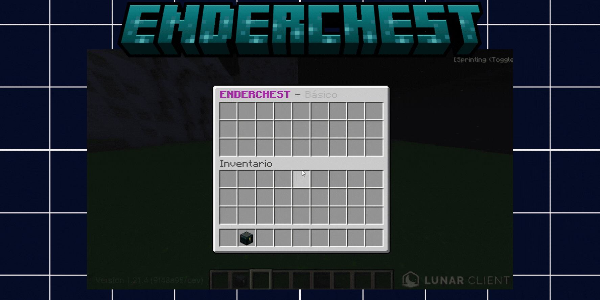
</p>

###  Premium EnderChest

A progression-based EnderChest system made to replace the basic vanilla storage experience with expandable, permission-based tiers.

Instead of giving every player the same storage, ASDCore allows the server to scale personal storage through ranks, permissions or progression rewards. This makes EnderChest access feel like an actual upgrade path inside the server economy.

Features:
- Multiple EnderChest tiers
- Permission-based storage upgrades
- Physical EnderChest support
- Command access
- Admin inspection tools
- Persistent player storage
- Custom open and interaction feedback

<details>
<summary>View Detailed Features</summary>

<br>

| Tier | Rows | Permission |
|---|---:|---|
| Basic | 3 | Default |
| Nova | 4 | `asdcore.enderchest.1` |
| Prime | 5 | `asdcore.enderchest.2` |
| Legend | 6 | `asdcore.enderchest.3` |

Commands:

```txt
/ec
/enderchest
/echest
/endersee <player>
```

Possible use cases:
- Rank rewards
- VIP perks
- Prison progression upgrades
- Staff moderation
- Economy-based storage expansion

</details>

---

<p align="center">
  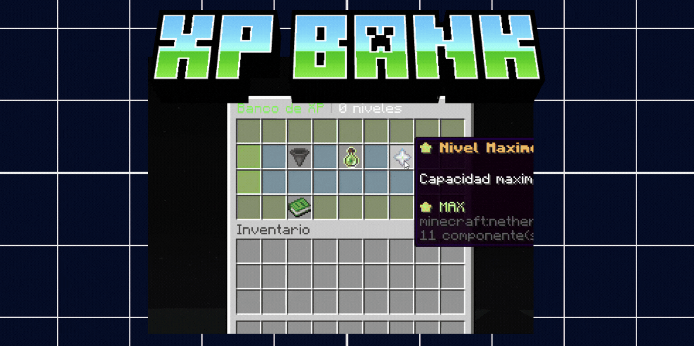
</p>

###  XP Bank

A safe XP banking system created for progression-heavy servers where experience is part of the economy, enchantment flow or player advancement.

Players can store experience instead of risking losing it, making XP a more meaningful resource inside long-term gameplay.

Features:
- Deposit XP
- Withdraw XP
- Level support
- Safe storage
- Useful for progression systems
- Useful for enchantment economies

<details>
<summary>View Detailed Features</summary>

<br>

The XP Bank is designed for servers where XP matters beyond vanilla enchanting.

Supported actions:
- Deposit specific XP amounts
- Deposit levels
- Withdraw stored XP
- Withdraw all
- Prevent unsafe XP loss
- Connect XP to custom progression systems

Commands:

```txt
/bancoxp
/bankxp
/bancoxp depositar
/bancoxp sacar
```

</details>

---

<p align="center">
  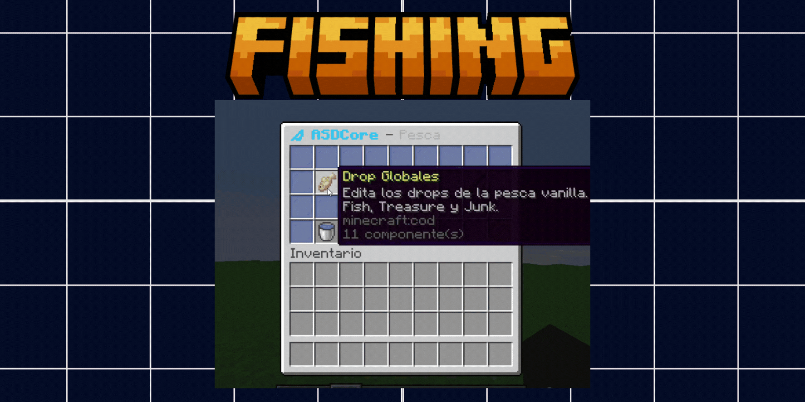
</p>

###  Progression Fishing Ecosystem

A complete fishing progression system designed to make fishing feel like an actual server activity instead of a passive vanilla mechanic.

The system can support special rods, upgraded hooks, custom loot, enchanted rewards, GUI interactions and progression-based fishing gameplay.

Features:
- Custom fishing progression
- Special fishing rods
- Hook / anzuelo mechanics
- Custom loot possibilities
- Fishing-related GUI systems
- Integration with rewards and economy
- Placeholder support for stats

<details>
<summary>View Detailed Features</summary>

<br>

The fishing system can be used as a full gameplay branch inside a Prison or Survival server.

Possible mechanics:
- Different fishing rarities
- Better loot depending on progression
- Special fishing tools
- Enchanted book rewards
- Fishing upgrades
- Fishing-based leaderboards
- Economy-connected catches
- Event fishing rewards
- Custom GUI management
- Player statistics

This turns fishing into a long-term activity with rewards, rankings and progression value.

</details>

---

<p align="center">
  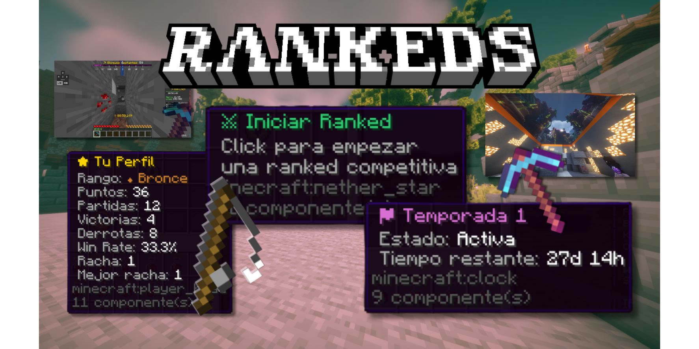
</p>

###  Ranked System

A competitive ranked infrastructure designed for multiple types of gameplay, not only PvP.

The goal of this system is to give players competitive activities inside the server with stats, points, rankings, modes and progression. It can support combat, mining, fishing and PvE-style challenges depending on the configuration and server design.

Features:
- Multiple ranked modes
- PvP and PvE possibilities
- Mining and fishing competitive modes
- Player statistics
- Points and rankings
- Spectating support
- PlaceholderAPI integration
- Discord bridge support
- Leaderboard compatibility

<details>
<summary>View Detailed Features</summary>

<br>

The Ranked System is one of the most ambitious parts of ASDCore.

It is designed as a competitive layer that can be adapted to several kinds of server content:

Possible ranked categories:
- PvP Ranked
- PvE Ranked
- Mining Ranked
- Fishing Ranked
- Solo modes
- Arena-based modes
- Score-based challenges
- Time-based challenges

Possible tracked stats:
- Points
- Rank name
- Victories
- Defeats
- Played matches
- Winrate
- Current streak
- Best streak
- Season data
- Top players

Useful for:
- Competitive prison activities
- Seasonal rankings
- Tournament systems
- PvP arenas
- Mining competitions
- Fishing competitions
- Server events

Example placeholders:
```txt
%asdcore_rankeds_puntos%
%asdcore_rankeds_rango%
%asdcore_rankeds_victorias%
%asdcore_rankeds_derrotas%
%asdcore_rankeds_winrate%
%asdcore_rankeds_racha%
%asdcore_rankeds_top_1_nombre%
```

</details>

---

<p align="center">
  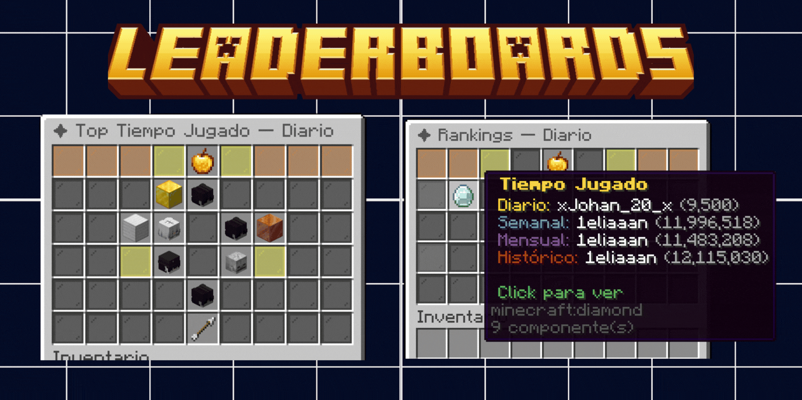
</p>

###  Leaderboards Ecosystem

A leaderboard system designed to highlight player progression across different activities and timeframes.

It allows the server to display competition beyond simple global stats, supporting daily, weekly and monthly rankings.

Features:
- Daily leaderboards
- Weekly leaderboards
- Monthly leaderboards
- General rankings
- GUI support
- Competitive progression support

<details>
<summary>View Detailed Features</summary>

<br>

Possible leaderboard categories:
- Mining
- Fishing
- Rankeds
- Economy
- Custom stats
- Event stats
- Progression stats

Commands:

```txt
/tops
/leaderboards
/hoy
/semanal
/mensual
```

Useful for:
- Keeping players active
- Creating weekly competition
- Rewarding top players
- Displaying server activity
- Supporting seasonal systems

</details>

---

<p align="center">
  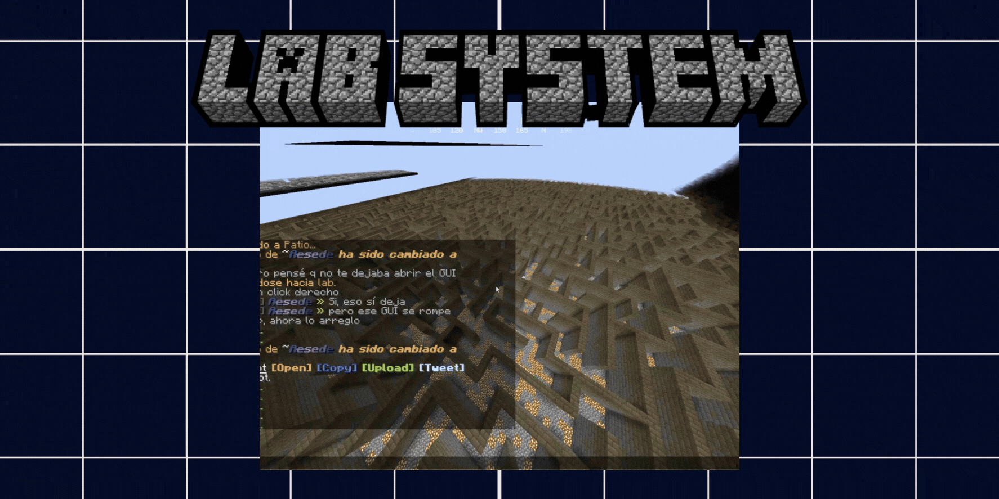
</p>

###  Lab System

A custom laboratory and puzzle-oriented system created for experimental gameplay, hidden progression, traps and server lore.

This system is designed for experiences where the player must explore, interact with mechanics, trigger events or solve progression paths instead of simply using commands.

Features:
- Puzzle progression
- Experimental mechanics
- Trap systems
- Region interaction
- GUI workflows
- Mob integration
- Lore-friendly structure

<details>
<summary>View Detailed Features</summary>

<br>

The Lab System can be used to create special zones, secret areas, progression tests or interactive server puzzles.

Possible mechanics:
- Hidden interactions
- Region-based triggers
- Custom tools
- Trap activation
- Mob spawning
- Puzzle states
- Path systems
- GUI-based control panels
- Server lore progression
- Admin tools for management

This system is useful for creating content that feels more like an adventure map or dungeon inside a normal Minecraft server.

</details>

---

<p align="center">
  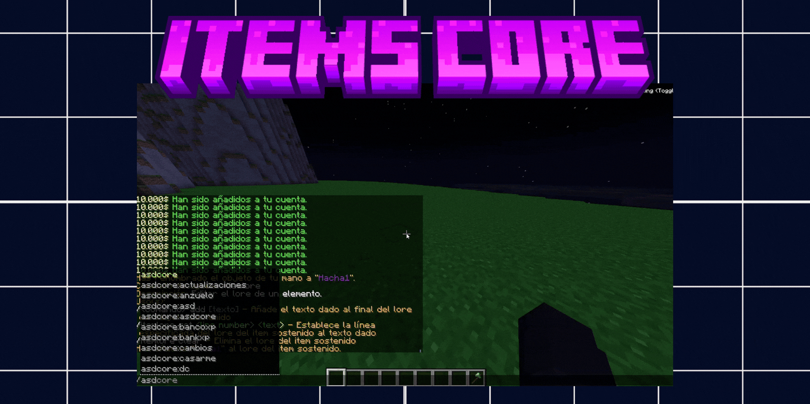
</p>

###  ItemScore Framework

A custom item framework for creating special server items with visual effects, metadata, categories and advanced behavior.

ItemScore is designed to make custom items feel more alive and recognizable through glow effects, drop particles, presets and internal item logic.

Features:
- Custom item presets
- Item categories
- Glow effects
- Particle effects on drop
- Visual item feedback
- Metadata handling
- GUI integration
- Event-based behavior

<details>
<summary>View Detailed Features</summary>

<br>

ItemScore can be used to create:
- Quest items
- Special keys
- Custom materials
- Progression items
- Magic items
- Event rewards
- Economy items
- Server tokens
- Rare drops

Possible configurable properties:
- Display name
- Lore
- Material
- Glow
- Rarity style
- Drop particles
- Visual effects
- Custom identifiers
- Event behavior
- Menu integration

This allows the server to have its own item identity without relying only on vanilla items.

</details>

---

<p align="center">
  
</p>

###  BlockScore Framework

A powerful custom block creation framework designed for interactive mechanics, puzzles and server-specific block behavior.

BlockScore is one of the systems with the most creative potential because custom blocks can be used as puzzle pieces, interactive objects, region triggers, special resources or progression elements.

Features:
- Custom block creation
- Configurable block properties
- Custom interactions
- Custom drops
- Break/place logic
- Persistent block data
- Event-driven behavior
- Puzzle system potential

<details>
<summary>View Detailed Features</summary>

<br>

BlockScore is not only about placing custom blocks. It can be used as a foundation for interactive gameplay.

Possible use cases:
- Puzzle networks
- Interactive doors
- Energy nodes
- Magical crystals
- Progression locks
- Custom mining blocks
- Special resource nodes
- Region triggers
- Hidden mechanisms
- Adventure map-style systems

Possible configurable behavior:
- What happens when the block is placed
- What happens when the block is broken
- Custom drops
- Custom permissions
- Linked actions
- Visual feedback
- Effects
- Region restrictions
- Event triggers

This makes it possible to create complex gameplay systems where blocks are not decoration, but functional components.

</details>

---

<p align="center">
  
</p>

###  MobScore Framework

A custom mob framework created to connect mobs with progression, regions, events and server mechanics.

Instead of treating mobs as isolated enemies, MobScore allows them to become part of a wider gameplay ecosystem.

Features:
- Custom mob logic
- Region integration
- Event hooks
- Reward handling
- Progression usage
- Gameplay modifiers

<details>
<summary>View Detailed Features</summary>

<br>

MobScore can support:
- Custom mob categories
- Region-based mob behavior
- Event mobs
- Special drops
- Combat interactions
- Progression enemies
- Puzzle mobs
- Server-specific creatures
- Mob rewards
- Trigger-based spawning

Possible use cases:
- Dungeon mobs
- Lab creatures
- Boss minions
- Progression enemies
- Event mobs
- Zone-specific threats

</details>

---

<p align="center">
  
</p>

###  RegionScore Engine

An advanced region gameplay engine used to create custom areas with unique rules, effects, visuals and interactions.

RegionScore allows regions to behave like real gameplay zones instead of simple protected areas. It can modify the environment, trigger mechanics and create atmospheric spaces without requiring a resource pack for certain visual changes.

Features:
- Custom region behavior
- Region flags
- Trigger systems
- Gameplay zones
- Environmental color changes
- Datapack-based visual customization
- Water, sky and ambience changes
- Region-specific mechanics

<details>
<summary>View Detailed Features</summary>

<br>

RegionScore can be used to create immersive server zones with custom logic.

Possible region features:
- Change water color
- Change sky color
- Change fog or ambience
- Use datapacks without requiring resource packs for certain environment changes
- Apply custom rules inside specific zones
- Trigger actions when entering or leaving
- Connect regions with puzzles
- Activate traps
- Restrict mechanics
- Enable special mobs
- Apply effects
- Link regions with progression systems

Possible use cases:
- Magical mines
- Radiation zones
- Lab areas
- Dungeon rooms
- Puzzle chambers
- Prison sectors
- Special biomes
- Event arenas
- Story zones

This system makes regions feel like custom worlds inside the same server.

</details>

---

<p align="center">
  
</p>

###  Donation Event Engine

A global event engine designed to trigger interactive server-wide activities connected to donation events or special celebrations.

Rather than only announcing a donation, the system can transform it into a playable moment for the community.

Features:
- Server-wide minigames
- Item rain events
- Lottery events
- Magic party
- Aquatic party
- Clover party
- BossBar announcements
- Timed rewards
- Configurable event flow

<details>
<summary>View Detailed Features</summary>

<br>

Donation Events can generate multiple types of community moments.

Included event styles:
- Item Rain
- Magic Party
- Aquatic Party
- Clover Party
- Lottery
- Timed reward events
- Global announcements
- BossBar-based status
- Configurable duration
- Configurable rewards

Possible use cases:
- Celebrating purchases
- Creating hype moments
- Rewarding online players
- Encouraging activity
- Making donations visible without being boring
- Turning monetization events into gameplay events

This system makes server events feel more alive and interactive.

</details>

---

<p align="center">
  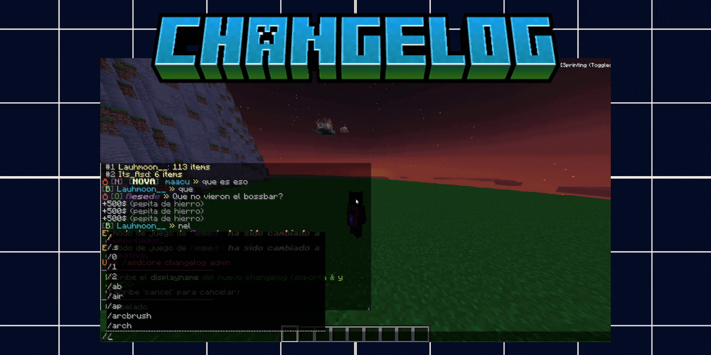
</p>

###  Changelog System

An in-game update and news system designed to show players what changed without needing Discord or external pages.

Features:
- Update menus
- News commands
- Player-facing changelogs
- Server update history
- GUI-based presentation

<details>
<summary>View Detailed Features</summary>

<br>

Commands:

```txt
/cambios
/actualizaciones
/nuevo
/news
```

Possible use cases:
- Show recent updates
- Explain new mechanics
- Announce fixes
- Present server changes
- Guide players after updates
- Keep the community informed inside the game

</details>

---

<p align="center">
  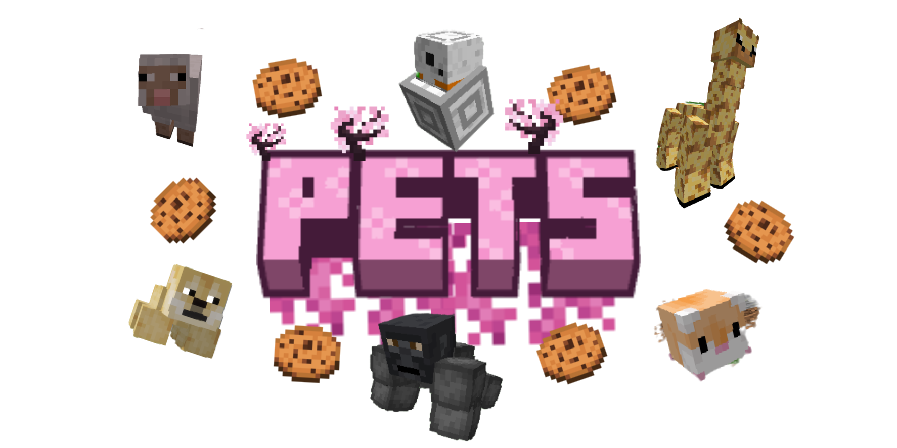
</p>

###  Pets Ecosystem

A large pet framework integrated with progression, rewards, inventories and gameplay systems.

The goal is to make pets feel like part of the server progression instead of cosmetic companions only.

Features:
- Pet inventory
- Active pet management
- Pet food
- Pet drops
- Pet vouchers
- Pet cooldowns
- Region restrictions
- Placeholder support

<details>
<summary>View Detailed Features</summary>

<br>

Pet systems:
- Active pet inventory
- Pet menu
- Pet food system
- Pet reward drops
- Pet voucher system
- Pet combat behavior
- Pet death cooldowns
- Region flags
- Player progression connection
- Admin commands
- Placeholder support

Possible use cases:
- Reward pets
- Progression pets
- Event pets
- Rank pets
- Rare collectible pets
- Pet-based bonuses

</details>

---

<p align="center">
  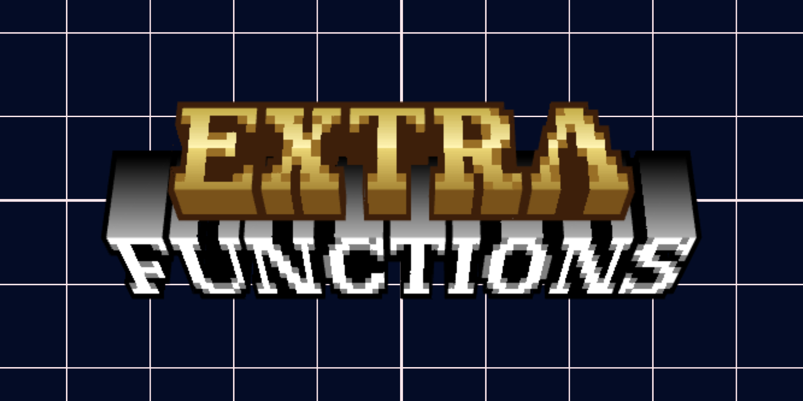
</p>

###  Additional Infrastructure

ASDCore also includes multiple utility systems that support the server ecosystem and connect with the main gameplay modules.

<details>
<summary>View Additional Modules</summary>

<br>

Additional systems:
- Resource pack manager
- GG chat mode
- Marriage system
- Lunar GUI
- Vouchers
- Tool systems
- Masteries
- ClearItems
- Timers
- NPC integration
- Global effects
- Utility systems
- Admin management tools
- Server event helpers

These systems are smaller individually, but together they make ASDCore work as a complete internal server framework.

</details>

---

<p align="center">
  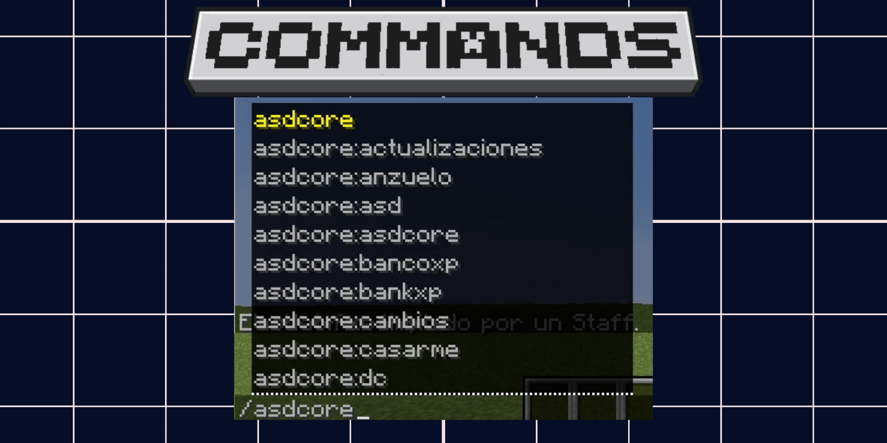
</p>

<p align="center">
  
</p>

| Command | Description | Permission |
|---|---|---|
| `/asdcore` | Main admin command | `asdcore.admin` |
| `/ec` | Opens premium EnderChest | `asdcore.enderchest.use.cmd` |
| `/endersee <player>` | View another player EnderChest | `asdcore.enderchest.see` |
| `/bancoxp` | Opens XP Bank | `asdcore.bank.xp` |
| `/rankeds` | Opens ranked system | `asdcore.rankeds` |
| `/tops` | Opens leaderboard menu | `asdcore.use` |
| `/leaderboards` | Opens leaderboard menu | `asdcore.use` |
| `/hoy` | Daily leaderboard | `asdcore.use` |
| `/semanal` | Weekly leaderboard | `asdcore.use` |
| `/mensual` | Monthly leaderboard | `asdcore.use` |
| `/maestrias` | View masteries | `asdcore.use` |
| `/petinv` | Opens active pet inventory | `asdcore.petinv.use` |
| `/pack descargar` | Apply resource pack | `asdcore.packrecursos` |
| `/cambios` | Opens changelog menu | `asdcore.cambios` |
| `/actualizaciones` | Opens changelog menu | `asdcore.cambios` |
| `/nuevo` | Opens news menu | `asdcore.cambios` |
| `/news` | Opens news menu | `asdcore.cambios` |

---

<p align="center">
  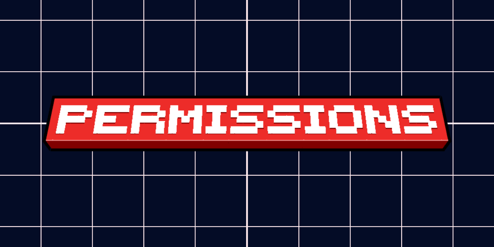
</p>

<p align="center">
  
</p>

| Permission | Description |
|---|---|
| `asdcore.admin` | Full admin access |
| `asdcore.use` | Basic ASDCore access |
| `asdcore.reload` | Reload configuration |
| `asdcore.bank.xp` | Use XP Bank |
| `asdcore.rankeds` | Access ranked system |
| `asdcore.petinv.use` | Use active pet inventory |
| `asdcore.packrecursos` | Resource pack system |
| `asdcore.enderchest.use` | Open physical EnderChest |
| `asdcore.enderchest.use.cmd` | Open EnderChest with commands |
| `asdcore.enderchest.see` | View player EnderChests |
| `asdcore.enderchest.1` | Nova EnderChest tier |
| `asdcore.enderchest.2` | Prime EnderChest tier |
| `asdcore.enderchest.3` | Legend EnderChest tier |
| `asdcore.items` | Custom item management |
| `asdcore.donativos.admin` | Donation event admin access |
| `asdcore.donativos.start` | Start donation events |
| `asdcore.temporizador` | Timer management |
| `asdcore.cambios` | Changelog access |
| `asdcore.pets.allowed` | Pet system access |
| `asdcore.pets.use` | Pets menu access |
| `asdcore.pet.use` | Active pet management |

---

<p align="center">
  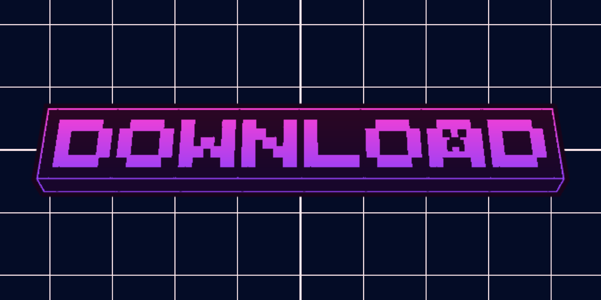
</p>

<p align="center">
  
</p>

ASDCore is released only as a compiled `.jar`.

The source code remains private because this project was developed exclusively for my own Minecraft network and infrastructure.

> This plugin is not intended to be a public commercial resource.

<p align="center">
  <a href="https://github.com/ItsAsddd/ASDCore-Showcase/releases">
    
  </a>
</p>

---

```txt
Minecraft Version: 1.21.4
Server Software: Paper
Project Type: Personal / Private Server Core
Source Code: Private
Public Usage: Showcase only
```

<p align="center">
  
  
  
</p>

<p align="center">
  Built as part of my Minecraft development journey.
</p>
